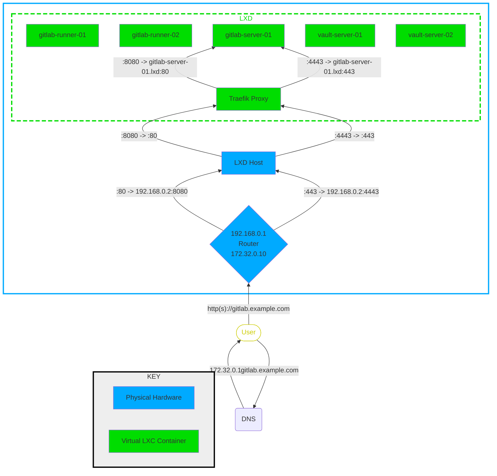

# Deploy GitLab, Vault & Traefik instances on LXD using Ansible + Terraform

## Network Connectivity Overiew

## Prerequisites

* lxd >4.0
* lxc
* Ansible
  * community.crypto.openssh_keypair plugin (install with `ansible-galaxy collection install community.crypto`)
  * community.general.lxd (install with `ansible-galaxy collection install community.general`)
* Terraform

## Running the code (TL;DR)

TODO: Tidy up

1. Clone repo
1. `cd ansible`
1. `ansible-playbook playbooks/site.yml --tags localhost`
1. `cd ../terraform/gitlab/server`
1. `terraform init`
1. `terraform apply --auto-approve`
1. `cd ../runner`
1. `terraform init`
1. `terraform apply --auto-approve`
1. `cd ../../vault`
1. `terraform init`
1. `terraform apply --auto-approve`
1. `cd ../../ansible`
1. Test elevated privilege ansible connectivity: `ansible lxd -b -m ping`
1. Connect directly: `ssh -i ssh_keys/id_ansible ansible@x.x.x.x` (grab IP from `lxc list` output)
1. `ansible-playbook playbooks/site.yml --skip-tags runner_register`
1. Navigate to GitLab "runners" page (under "admin") and copy the runner registration token
1. `ansible-playbook playbooks/site.yml --tags runner_register -e "runner_registration_token=vMZms9z6uKBKcxxKTDAC"`

# Known issues

1. Raft storage cluster nodes do not connect on CentOS-based images so using Ubuntu images instead.

# TODO:

1. Add ssh server terraform deployment method and docs
1. Remove roles from repo and clone them when needed instead
1. Ansiblise the CA, key, crt & csr creation steps for traefik mTLS (see [these notes](ansible/playbooks/traefik/config_notes.md) for details)
1. Fix GitLab mail
1. Add GitLab backup/restore functionality/roles
1. Consider making runner registration idempotent - currently keeps registering runners
1. Tidy up variables & remove unused ones
1. Convert module names to FQCNs
1. Consider shifting the CloudInit config directory into each project dir to keep it grouped
1. Create unit file for traefik service
1. Consider using Vault as CA for self-signed traefik certs
1. Update README :-)

# My goal

Create a Gitlab instance that uses Vault for secret management

# My journey

This repo has evolved over a long time from initially standing up a 3-node cluster of vault servers using virtualbox. Not before long, I realised vbox was slow and not very scallable. So I then started devloping on GCP using Terraform - that was fun and made life easier (actually it made it more complicated at first having to learn new concepts and tools but nonetheless the right way to do things). After a year my free subscription ran out which left me a bit lost, so I turned back to self-hosting. I bought a powerful Mini PC from Asus and set about creating my home lab. Wanting to continue using Terraform and being able to scale my infrastructure, I chose LXC/LXD as my platform. There are terraform and Ansible plugins that allow me to spin up instances and connect dynamically if a bit of prep work has been done. My journey has definitely branched out from my initial goal which has been great for learning new technology and tools. One of the best ones is the reverse proxy `traefik` which has forced me to learn/bolster knowledge of concepts that I only half-understood eg TLS/mTLS.

Here, I attempt to show the current status of the project in bullet points:

* Host Server
  * Asus PN51 running Ubuntu Desktop 22.04
* Hypervisor
  * LXD
* Ansible
  * **Preparation**: Create SSH key pairs locally & creat the cloud init config for the LXC containers
  * **Provision**: Configure target hosts with services (traefik, vault, gitlab)
* Terraform
  * Manage LXC container deployments
    Service | Instances
    --------|----------
    Traefik | 1
    Gitlab Server | 1
    Gitlab Runners | 4
    Vault Servers | 3
    Web Servers | 5
* Traefik
  * Reverse proxy for redirecting sub-domain traffic to LXC containers
  * Uses a mixture of TLS configurations
    * TLS passthrough for Gitlab instance as it already uses letsencrypt
    * Other services have TLS termination at traefik server (automatically retrieving certs from LetsEncrypt - brilliant!)
    * Originally used HTTP for upstream backend LCX connections
    * Configured HTTPS using self-signed certificates for upstream traffic
    * Intend to use mTLS so backend upstream services can trust the traefik server
    * Consider using Vault as the CA for certs
* Vault
  * 3 node cluster
  * Only accessible internally (considering opening this up...)
* Gitlab
  * 1 server instance
  * 4 runners using docker-in-docker for pipelines
* Web servers
  * Only playing with these at the moment
  * Load balanced behind traefik instance
  * Testing TLS/mTLS configurations

# References

This blog helped me select the correct LXD configuration & LXC container settings:
https://blog.canutethegreat.com/portable-devops-platform-gitlab-in-an-lxd-container-db2850224caf

This may be useful for running packer on LXC images in a pipeline using a docker-based runner
https://github.com/micw/docker-lxc-demo/blob/master/Dockerfile
